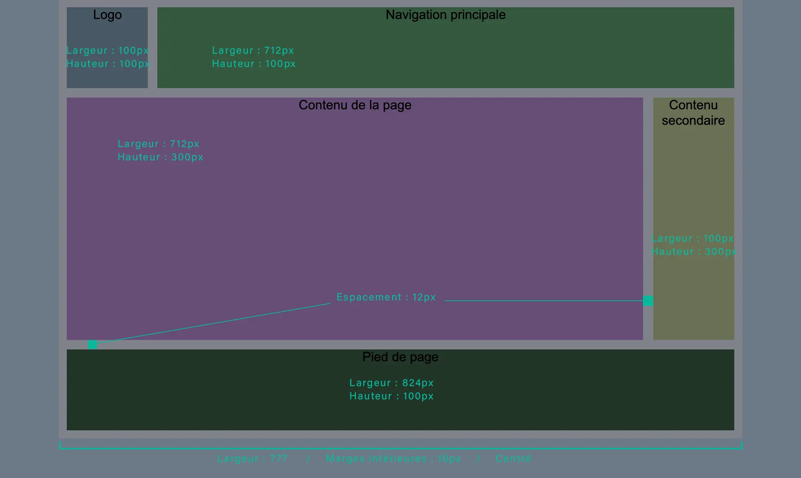

# Exercice grid
GRID
## Contexte de réalisation
- À partir des fichiers
    - `_assets/resultat.webp`
    - `index.html`

- Dans le document : `css/_exercice.scss`
    - RÉDIGER le code CSS pour positionner les éléments à l’aide du système « grid » 
    - Le résutlat doit être IDENTIQUE au fichier `_assets/resultat.webp`
